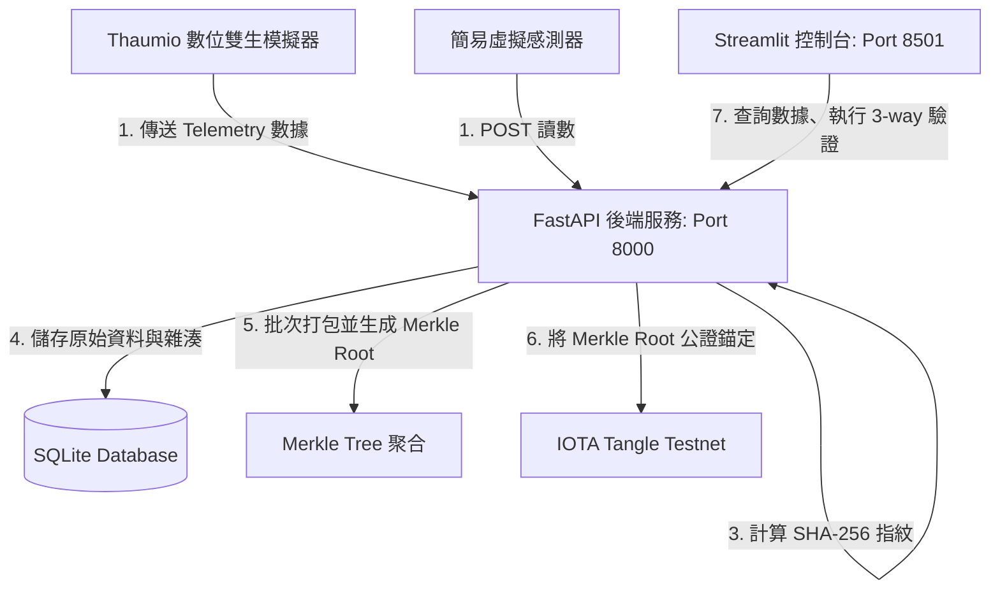

# 🔒 IoT Data Integrity Verifier (IOTA Tangle)

> **基於 IOTA 測試網與 Merkle Tree 聚合的物聯網邊緣數據完整性驗證系統**
> 本專案為物聯網設備提供去中心化、低成本、防篡改的數據公證（Notarization）與三向核對（3-way Verification）審計方案。

---

## 📊 系統架構設計 (System Architecture)

系統整合了 **Thaumio 數位雙生引擎**、**FastAPI 高效後端**、**SQLite 邊緣儲存**、以及 **IOTA 分佈式账本 (Tangle)**：



---

## ⚡ 核心功能特色 (Key Features)

* **高保真度數據生成 (IoT Simulation)**：支援 Thaumio 數位雙生拓撲（正弦波、隨機漫步）以及加入高斯噪聲（Gaussian Noise）的簡易感測器模擬。
* **事件過濾減載 (Event Filtering)**：智能區分常態數據與異常事件，常態數據僅留存本地校驗，異常事件才進行鏈上公證，節省高達 90% 區塊鏈儲存開銷與網路頻寬。
* **默克爾樹批次聚合 (Merkle Tree Aggregation)**：將多個異常事件的雜湊值打包成 Merkle Tree，僅將唯一的 Merkle Root 錨定至 IOTA，實現 $O(1)$ 空間複雜度的鏈上公證。
* **三向完整性審計 (3-Way Verification)**：校驗「本地原始數值重新計算的 Hash」、「SQLite 記錄的 Hash」以及「IOTA 鏈上對比 Merkle Proof 還原的 Root」，即時抓出任何資料庫篡改。
* **安全威脅篡改演示 (Tamper & Attack Simulation)**：內建數據篡改 API，一鍵強行修改資料庫數值，向觀眾具體演示系統是如何偵測並發出 `WARNING` 與 `CRITICAL` 警報。
* **模擬閘道開關 (Simulated Gateway Disconnection)**：儀表板一鍵斷開/重連與模擬閘道的連結，暫停新數據寫入，方便展示靜態數據上鏈與驗證。

---

## 📁 目錄結構說明 (Project Directory)

```text
iota-project/
├── app/                  # FastAPI 後端服務
│   ├── config.py         # 系統設定 (資料庫、IOTA 節點等)
│   ├── crud.py           # SQLite DB CRUD 操作
│   ├── database.py       # SQLAlchemy 資料庫連接配置
│   ├── hasher.py         # SHA-256 數據雜湊算法 (包含 Rounding 規則)
│   ├── iota_client.py    # IOTA SDK 交互封裝 (公證/拉取交易)
│   ├── main.py           # API 接口路由設計
│   ├── merkle.py         # Merkle Tree 生成與證明核對核心
│   ├── models.py         # SQLAlchemy 資料模型
│   ├── schemas.py        # Pydantic 數據校驗模型
│   └── verifier.py       # 3-way 校驗審計引擎
├── config/               # 拓撲配置資料夾
│   └── thaumio_topology.json # Thaumio 物聯網環境與網關配置文件
├── dashboard/            # 前端儀表板
│   └── app.py            # Streamlit 網頁應用程式
├── sensor/               # 感測器端模擬
│   ├── simulator.py      # 高斯物理噪聲模擬器
│   ├── thaumio_sensor.py # 真實對接 Thaumio 引擎的模擬腳本
│   └── virtual_sensor.py # 輕量級模擬數據發送腳本
├── tests/                # 測試套件
│   ├── test_integrity_system.py # 雜湊防偏差、模擬器範圍測試
│   └── test_merkle.py    # Merkle 樹建置與證明邊界測試
├── thaumio/              # (Git Submodule) Thaumio 物聯網數位雙生模擬模組
├── requirements.txt      # 專案套件依賴清單
└── README.md             # 本說明文件
```

---

## 🚀 快速開始使用指南 (Getting Started)

### 1. 複製專案與初始化子模組
如果您是第一次下載此專案，請務必初始化並下載 `thaumio` 子模組：
```bash
git clone --recursive https://github.com/chunhao0613/iota-project.git
cd iota-project

# 若未帶 --recursive，可手動拉取：
git submodule update --init --recursive
```

### 2. 準備開發環境
在根目錄下，使用 Python 虛擬環境並安裝所需的套件：
```powershell
# 建立虛擬環境
python -m venv .venv

# 啟用虛擬環境 (Windows)
.venv\Scripts\activate

# 安裝依賴套件
pip install -r requirements.txt
```

### 3. 依序啟動系統服務 (請使用三個終端機視窗)

* **步驟一：啟動 FastAPI 後端**
  ```powershell
  .venv\Scripts\uvicorn app.main:app --reload
  ```
  *(可訪問 Swagger API 文件：[http://127.0.0.1:8000/docs](http://127.0.0.1:8000/docs))*

* **步驟二：啟動感測器模擬器 (二選一)**
  * **選項 A：真實對接 Thaumio 數位雙生 (推薦 🌟)**
    ```powershell
    .venv\Scripts\python sensor/thaumio_sensor.py
    ```
  * **選項 B：簡易虛擬感測器**
    ```powershell
    .venv\Scripts\python sensor/virtual_sensor.py
    ```

* **步驟三：啟動 Streamlit 視覺化控制台**
  ```powershell
  .venv\Scripts\streamlit run dashboard/app.py
  ```
  *(瀏覽器會自動開啟 [http://localhost:8501](http://localhost:8501))*

---

## 🧪 混沌工程注入測試 (Chaos Engineering)

Thaumio 模擬器內建 Control Plane 服務（運行於 `Port 8081`），您可以模擬極端環境事件以產生異常數據：

* **注入熱浪事件指令 (PowerShell)**：
  ```powershell
  $body = @{
      event = "heatwave"
      duration_sec = 30.0
      overrides = @{
          base_temp = "45.0"
          humidity = "95.0"
      }
  } | ConvertTo-Json

  Invoke-RestMethod -Method Post -Uri "http://127.0.0.1:8081/api/env/env_greenhouse_a/event" -Body $body -ContentType "application/json"
  ```
  這會使環境的溫度暴增至 $45^\circ\text{C}$，從而觸發後端的 **Event Filter** 開始在資料庫儲存待上鏈（`PENDING`）的異常數據。

---

## 🛡️ 安全威脅防禦矩陣 (Security Matrix)

| 威脅情境 | 潛在後果 | 系統防禦與緩解手段 | 警報層級 |
| :--- | :--- | :--- | :--- |
| **資料庫數值遭修改**<br>(SQLite Direct Edit) | 監控系統被欺騙，故障警報失效。 | **本地雜湊核對**：比對當前數據算出的 SHA-256 與資料庫儲存的雜湊是否吻合。 | `WARNING` |
| **雜湊欄位被同時覆寫**<br>(Hash Overwriting) | 本地雜湊校驗失效。 | **IOTA 鏈上公證**：比對本地 Merkle Proof 與 IOTA 鏈上不可篡改的 Merkle Root。 | `CRITICAL` |
| **裝置身分偽造**<br>(Device Spoofing) | 系統寫入大量偽造遙測資料。 | **元數據聯合雜湊**：雜湊指紋中鎖定了 `device_id` 與 `firmware_version` 結構。 | `CRITICAL` |

---

## ⚙️ 執行單元測試 (Unit Tests)

本專案附帶完整的單元測試套件，包含對 Merkle Tree、數據雜湊四捨五入防微調、模擬器合理性的功能檢驗：
```powershell
.venv\Scripts\python -m unittest discover tests
```
**預期輸出**：
```text
.......
----------------------------------------------------------------------
Ran 7 tests in 0.000s

OK
```
